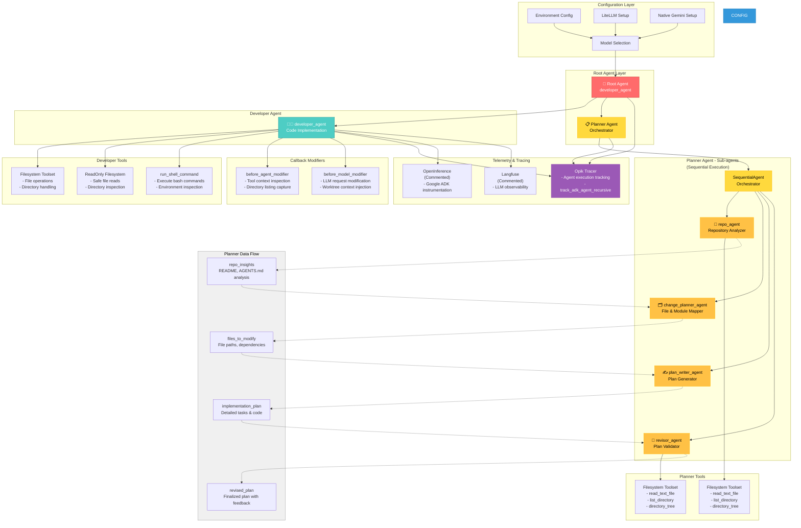

# The Enchanted Doll Shop - Backend API

This is a FastAPI-based backend for a doll shop. It provides features for managing doll inventory and scheduling playtime reservations.

## Features

- **Doll Inventory Management (CRUD)**:
    - List all dolls (with type filtering).
    - Add new dolls.
    - Retrieve detailed doll information.
    - Update doll attributes.
    - Remove dolls from inventory.
- **Playtime Reservations**:
    - Book playtime slots for dolls.
    - Automatic validation for:
        - Doll existence and availability.
        - Future reservation times.
        - Overlapping reservations (assuming 1-hour slots).
    - View all scheduled reservations.
    - Cancel reservations.
- **Quick Utility**:
    - Specialized endpoint for quick price, weight, and shipping category checks.

## Tech Stack

- **Framework**: FastAPI
- **Data Validation**: Pydantic
- **Language**: Python 3.9+
- **Database**: In-memory (for demonstration)

## Agent Architecture



### Agent Workflow

#### Root Agent Layer
- **Root Agent** (`developer_agent`): Primary entry point for implementing code

#### Developer Agent
- Executes filesystem operations and shell commands
- Uses `filesystem_toolset` for file/directory creation and modification
- Uses `run_shell_command` for testing and validation
- Applies callback modifiers for context injection

#### Planner Agent (Sequential Workflow)
The PlannerAgent orchestrates a multi-stage planning process through a SequentialAgent:

1. **repo_agent** → Analyzes repository structure
   - Tools: Filesystem inspection (read_text_file, list_directory, directory_tree)
   - Output: `repo_insights` (README.md and AGENTS.md analysis)

2. **change_planner_agent** → Maps required changes
   - Input: repo_insights
   - Output: `files_to_modify` (file paths, dependencies, impact analysis)
   - No tools (analysis only)

3. **plan_writer_agent** → Creates detailed implementation plan
   - Input: files_to_modify
   - Output: `implementation_plan` (specific tasks, code snippets)
   - No tools (synthesis only)

4. **revisor_agent** → Validates and refines plan
   - Tools: Filesystem inspection (validate file paths and references)
   - Input: implementation_plan
   - Output: `revised_plan` (finalized with feedback and recommendations)

#### Bash Agent
- Validates work by running tests and service checks (currently commented)

### Callback Flow

1. **before_agent_modifier**: Captures worktree context before tool execution
2. **before_model_modifier**: Injects worktree context into LLM system instructions

### Telemetry

- **Opik**: Active tracing with `track_adk_agent_recursive()` for recursive agent monitoring
  - Tracks all agent executions (root, developer, planner, and sub-agents)
  - Logs metadata and performance metrics
- **OpenInference & Langfuse**: Available but commented out for debugging observability

## Getting Started

### Prerequisites

- Python 3.9 or higher
- `pip`

### Installation

1. Install dependencies:
   ```bash
   pip install -r doll_shop/requirements.txt
   ```

2. Run the server:
   ```bash
   uvicorn doll_shop.main:app --reload
   ```

3. Access the API documentation:
   - Interactive Swagger UI: `http://127.0.0.1:8000/docs`
   - ReDoc: `http://127.0.0.1:8000/redoc`

## API Endpoints

### Inventory
- `GET /dolls`: List all dolls. Optional `type` query parameter (`wooden`, `fluffed`, `electronic`).
- `POST /dolls`: Add a new doll.
- `GET /dolls/{doll_id}`: Get details of a specific doll.
- `PUT /dolls/{doll_id}`: Update doll details.
- `DELETE /dolls/{doll_id}`: Remove a doll.

### Reservations
- `POST /reservations`: Book a playtime slot.
- `GET /reservations`: View all reservations.
- `DELETE /reservations/{res_id}`: Cancel a reservation.

### Quick Check
- `GET /dolls/{doll_id}/price-check`: Get quick pricing and shipping info.
